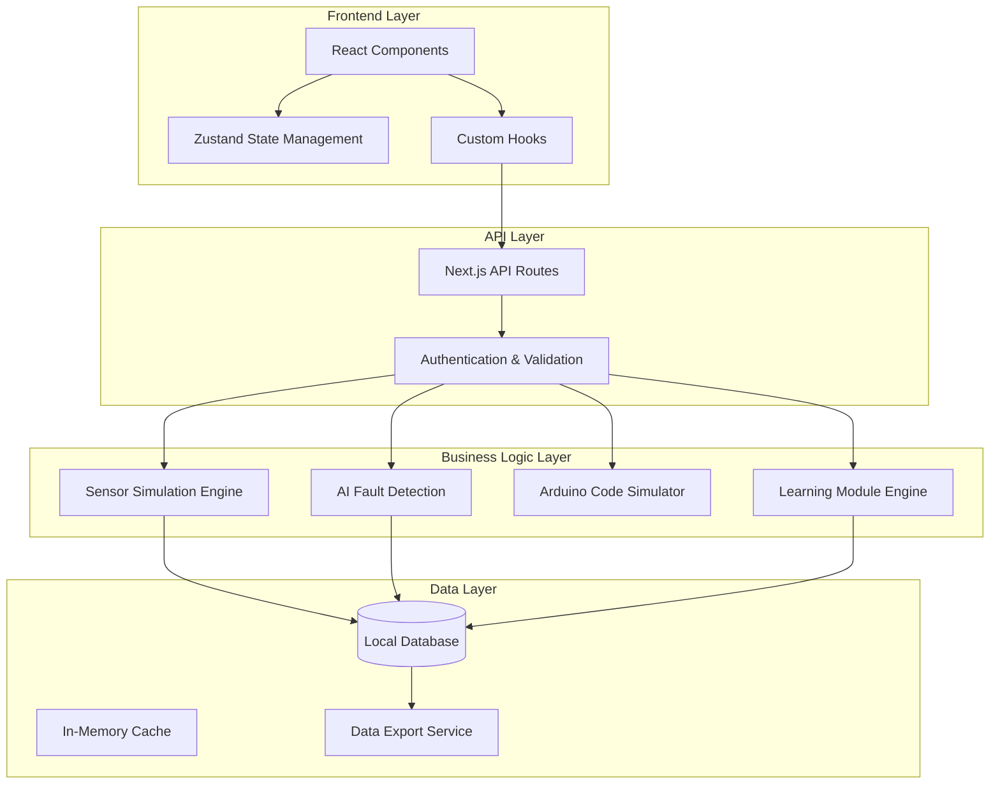
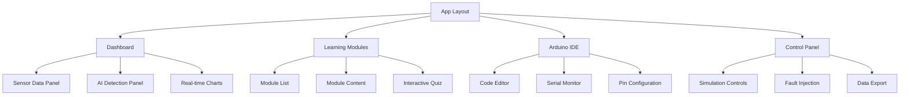

# Design Document

## Overview

The Automotive AI Simulator is a comprehensive web-based educational platform designed for SMK Teknik Otomotif. The application combines real-time sensor simulation, AI-powered diagnostics, Arduino integration, and interactive learning modules in a modern, responsive interface.

The system architecture follows a modular, component-based design using Next.js 15 with App Router, ensuring scalability, maintainability, and optimal performance for educational environments.

## Architecture

### High-Level Architecture



### Technology Stack

- **Frontend**: Next.js 15 (App Router), React 18, TypeScript 5
- **Styling**: Tailwind CSS 4, shadcn/ui components
- **State Management**: Zustand for global state, React Hook Form for forms
- **Data Fetching**: TanStack Query with Axios
- **Database**: SQLite with Prisma ORM for local data persistence
- **Charts & Visualization**: Recharts, D3.js for advanced visualizations
- **Animations**: Framer Motion for smooth transitions
- **Code Editor**: Monaco Editor for Arduino code editing

## Components and Interfaces

### Core Components Architecture



### Component Specifications

#### 1. Sensor Simulation Components

**SensorDataProvider**
```typescript
interface SensorData {
  engineTemp: number;
  oilPressure: number;
  batteryVoltage: number;
  engineVibration: number;
  rpm: number;
  timestamp: Date;
}

interface SensorConfig {
  samplingRate: number;
  noiseLevel: number;
  faultInjection: boolean;
}
```

**Real-time Chart Components**
- LineChart for continuous data (temperature, RPM)
- GaugeChart for instantaneous readings (pressure, voltage)
- HistogramChart for vibration analysis
- StatusIndicator for system health

#### 2. AI Detection Components

**AIDetectionEngine**
```typescript
interface DetectionResult {
  parameter: string;
  confidence: number;
  status: 'normal' | 'warning' | 'critical';
  recommendation: string;
  timestamp: Date;
}

interface AIModel {
  type: 'RandomForest';
  parameters: {
    nEstimators: number;
    maxDepth: number;
    threshold: number;
  };
}
```

#### 3. Learning Module Components

**ModuleStructure**
```typescript
interface LearningModule {
  id: string;
  title: string;
  category: 'electrical' | 'cooling' | 'fuel' | 'vibration';
  content: {
    theory: string;
    simulation: SimulationConfig;
    codeExamples: CodeExample[];
    quiz: QuizQuestion[];
  };
  progress: UserProgress;
}
```

#### 4. Arduino Integration Components

**ArduinoSimulator**
```typescript
interface ArduinoProject {
  code: string;
  pinConfiguration: PinConfig[];
  serialOutput: string[];
  compileStatus: 'success' | 'error';
  errors: CompileError[];
}

interface PinConfig {
  pin: number;
  mode: 'INPUT' | 'OUTPUT' | 'INPUT_PULLUP';
  value: number;
  connected: boolean;
}
```

## Data Models

### Database Schema

```sql
-- Sensor data table
CREATE TABLE sensor_readings (
  id INTEGER PRIMARY KEY AUTOINCREMENT,
  engine_temp REAL,
  oil_pressure REAL,
  battery_voltage REAL,
  engine_vibration REAL,
  rpm INTEGER,
  timestamp DATETIME DEFAULT CURRENT_TIMESTAMP
);

-- AI detection results
CREATE TABLE ai_detections (
  id INTEGER PRIMARY KEY AUTOINCREMENT,
  parameter TEXT,
  confidence REAL,
  status TEXT,
  recommendation TEXT,
  timestamp DATETIME DEFAULT CURRENT_TIMESTAMP
);

-- User progress tracking
CREATE TABLE user_progress (
  id INTEGER PRIMARY KEY AUTOINCREMENT,
  module_id TEXT,
  user_session TEXT,
  completion_percentage REAL,
  quiz_scores TEXT, -- JSON array
  last_accessed DATETIME
);

-- Arduino projects
CREATE TABLE arduino_projects (
  id INTEGER PRIMARY KEY AUTOINCREMENT,
  name TEXT,
  code TEXT,
  pin_config TEXT, -- JSON
  created_at DATETIME DEFAULT CURRENT_TIMESTAMP,
  modified_at DATETIME DEFAULT CURRENT_TIMESTAMP
);
```

### State Management Schema

```typescript
interface AppState {
  // Sensor simulation state
  sensors: {
    data: SensorData[];
    config: SensorConfig;
    isRunning: boolean;
  };
  
  // AI detection state
  ai: {
    results: DetectionResult[];
    model: AIModel;
    isAnalyzing: boolean;
  };
  
  // Learning modules state
  learning: {
    currentModule: string | null;
    progress: Record<string, UserProgress>;
    quizResults: QuizResult[];
  };
  
  // Arduino state
  arduino: {
    currentProject: ArduinoProject;
    projects: ArduinoProject[];
    serialMonitor: string[];
  };
  
  // UI state
  ui: {
    theme: 'light' | 'dark';
    activeTab: string;
    notifications: Notification[];
  };
}
```

## Error Handling

### Error Categories and Handling Strategy

1. **Sensor Simulation Errors**
   - Connection timeouts: Retry with exponential backoff
   - Data validation errors: Log and use fallback values
   - Performance issues: Reduce sampling rate automatically

2. **AI Processing Errors**
   - Model loading failures: Show error message, disable AI features
   - Prediction errors: Log error, show confidence as 0%
   - Memory issues: Clear old data, implement data rotation

3. **Arduino Code Errors**
   - Syntax errors: Show in editor with line highlighting
   - Compilation errors: Display in error panel with suggestions
   - Runtime errors: Capture in serial monitor

4. **Data Persistence Errors**
   - Database connection issues: Use in-memory fallback
   - Export failures: Retry with different format
   - Storage quota exceeded: Implement automatic cleanup

### Error Boundary Implementation

```typescript
interface ErrorBoundaryState {
  hasError: boolean;
  error: Error | null;
  errorInfo: ErrorInfo | null;
}

// Global error handling with user-friendly messages
const errorMessages = {
  SENSOR_CONNECTION_FAILED: "Sensor simulation unavailable. Using demo data.",
  AI_MODEL_LOAD_FAILED: "AI detection temporarily disabled. Manual analysis available.",
  DATABASE_ERROR: "Data saving disabled. Export current session before continuing.",
  ARDUINO_COMPILE_ERROR: "Code compilation failed. Check syntax and try again."
};
```

## Testing Strategy

### Unit Testing
- **Components**: Test all React components with React Testing Library
- **Hooks**: Test custom hooks with @testing-library/react-hooks
- **Utilities**: Test sensor simulation algorithms and AI detection logic
- **API Routes**: Test all Next.js API endpoints with Jest

### Integration Testing
- **Sensor Data Flow**: Test real-time data generation and display
- **AI Detection Pipeline**: Test end-to-end fault detection workflow
- **Learning Module Interaction**: Test quiz functionality and progress tracking
- **Arduino Simulation**: Test code compilation and execution simulation

### Performance Testing
- **Real-time Updates**: Ensure 60fps with continuous sensor data updates
- **Memory Usage**: Monitor for memory leaks during extended sessions
- **Database Operations**: Test query performance with large datasets
- **Bundle Size**: Optimize for fast initial load times

### Accessibility Testing
- **Keyboard Navigation**: Ensure all features accessible via keyboard
- **Screen Reader Support**: Test with NVDA/JAWS for educational accessibility
- **Color Contrast**: Verify WCAG AA compliance for both themes
- **Focus Management**: Proper focus handling in modal dialogs and tabs

### Browser Compatibility Testing
- **Modern Browsers**: Chrome 90+, Firefox 88+, Safari 14+, Edge 90+
- **Mobile Browsers**: iOS Safari, Chrome Mobile, Samsung Internet
- **Responsive Design**: Test on tablet and mobile form factors
- **Performance**: Ensure smooth operation on lower-end devices

## Performance Optimization

### Real-time Data Optimization
- **WebSocket Connection**: Efficient real-time data streaming
- **Data Throttling**: Limit update frequency based on device capabilities
- **Virtual Scrolling**: Handle large datasets in charts and tables
- **Memoization**: Cache expensive calculations and component renders

### Bundle Optimization
- **Code Splitting**: Lazy load learning modules and Arduino IDE
- **Tree Shaking**: Remove unused dependencies and code
- **Image Optimization**: Use Next.js Image component with WebP format
- **CSS Optimization**: Purge unused Tailwind classes

### Database Performance
- **Indexing**: Create indexes on frequently queried columns
- **Data Rotation**: Implement automatic cleanup of old sensor data
- **Batch Operations**: Group database writes for better performance
- **Connection Pooling**: Optimize database connection management